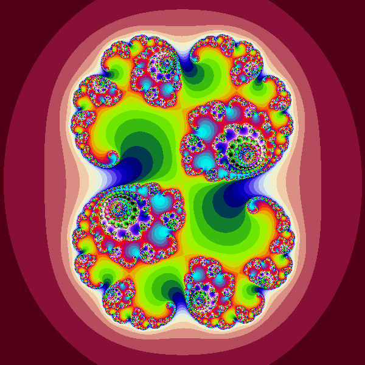
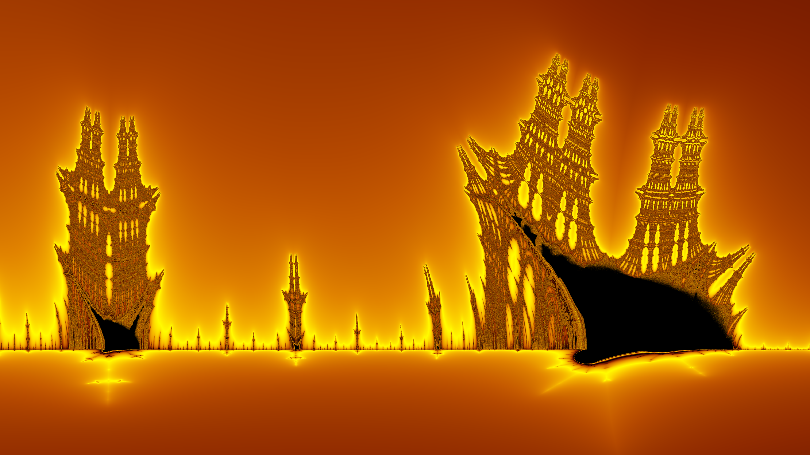

# Fract'ol

A graphical project exploring the fascinating world of fractals, created as part of the 42 school curriculum.

## 📝 Description

**Fract'ol** is a C program that allows you to visually generate and explore different mathematical fractals using the **MiniLibX** graphics library. This project highlights concepts like optimization, pixel rendering, and the beauty of mathematics through complex numbers.

## 🖼️ Gallery (Screenshots)

*Note: Replace the image links with your own screenshots hosted on GitHub or in an `assets/` folder.*

### Mandelbrot


### Julia


### Burning Ship


## ✨ Features

- **Supported fractals:**
  - `mandelbrot`: The classic Mandelbrot set.
  - `julia`: The Julia set, highly customizable via complex number parameters.
  - `burning`: The Burning Ship fractal, with its unique asymmetrical shape.
- **Fluid interactivity:**
  - Zoom in and out centered on the mouse pointer.
  - Panning across the fractal using the arrow keys.
- **Dynamic rendering:**
  - Real-time adjustment of the iteration count to reveal fine details during deep zooms.
  - Dynamically calculated coloring for visually pleasing rendering.

## 🛠️ Installation and Compilation

### Prerequisites
- `gcc` or `clang` compiler
- X11 library (`libxext-dev` and `libx11-dev` on Linux)

### Compilation
Clone the repository and compile the project using the `make` command:

```bash
git clone git@github.com:MehdiZ7/Fractol.git fractol
cd fractol
make
```

### Execution

Run the program by passing the name of the fractal as an argument:

```bash
# To display the Mandelbrot set
./fractol mandelbrot

# To display the Burning Ship set
./fractol burning

# To display the Julia set (requires two parameters for the complex number)
./fractol julia -0.835 -0.2321
./fractol julia -0.4 0.6
```

## 🎮 Controls

| Action | Control |
|--------|----------|
| **Zoom in / Zoom out** | Mouse wheel (Button 4 / Button 5) |
| **Move (Up/Down/Left/Right)** | Arrow keys (`Up`, `Down`, `Left`, `Right`) |
| **Increase iterations (more detail)** | `+` key (or `Page Up`) |
| **Decrease iterations (less detail)** | `-` key (or `Page Down`) |
| **Quit program** | `ESC` key or click the window's close button |

## 🏗️ Project Architecture

- `main.c`: Entry point, argument handling, and MLX loop initialization.
- `parsing.c`: User input verification and validation.
- `create_window.c`: MiniLibX initialization, window, and image creation.
- `create_fractal.c`, `create_julia.c`, `create_burning.c`: Rendering algorithms for the respective fractals.
- `events.c`: Keyboard and mouse events handling (hooks).
- `math_utils.c`: Mathematical utility functions (complex numbers, scaling interpolation).
- `libft/`: Custom C standard library (42 libft).

## 👨‍💻 Author

- **mzouhir**
